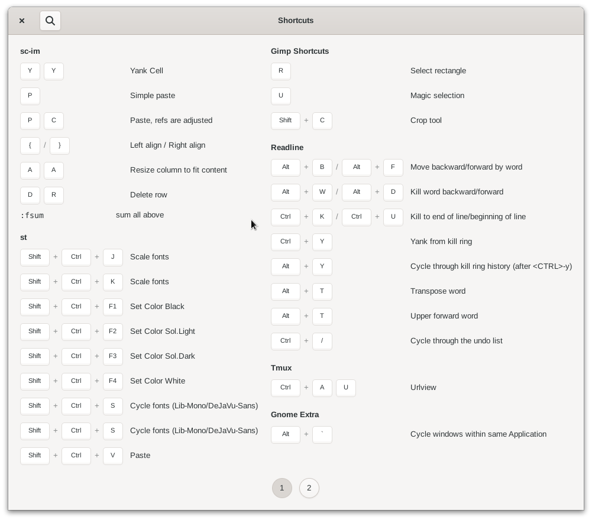

<p align="center">
  
</p>
<h1 align="center">My Hotkeys</h1>
<h4 align="center">A personal hotkeys cheatsheet sitting on your shoulder</h4>

<p align="center">
  
</p>

## NOTE WIP

This project is in active development. Everything can change.

## Develop

```
git clone https://github.com/mipmip/gnome-hotkeys.cr
cd gnome-hotkeys.cr
nix develop
shards
make
```

## Usage

```
./bin/myhotkeys -c ./test.json
```

## TODO v1.0
- [x] compile UI at runtime
- [x] input file argument
- [x] solution for displaying command words (custom widget)
- [x] forward slash (slash)
- [x] backtick (grave)
- [x] play in builder to find all possibilities
- [ ] subclass shortcutsshortcut.c
  - [ ] accel-size-group
  - [ ] title-size-group
  - [ ] new type: command
  - [ ] search match group titles for single shortcuts
- [ ] subclass more
  - [ ] make custom layout things: semi trans and more
- [ ] add gnome extensions and desktop shortcuts
- [ ] max-height config
- [ ] find way to clear UI cache
- [ ] documentation
- [ ] intergrate with shell extension
- [ ] add buttons to menubar
  - [ ] about
  - [ ] configure
- [ ] control ordering
- [ ] more sections...?
- [ ] name
  - cheat

## ROADMAP 2.0
- current application aware
- plugin system

## Contributing

1. Fork it (<https://github.com/mipmip/gnome-hotkeys.cr/fork>)
2. Create your feature branch (`git checkout -b my-new-feature`)
3. Commit your changes (`git commit -am 'Add some feature'`)
4. Push to the branch (`git push origin my-new-feature`)
5. Create a new Pull Request
